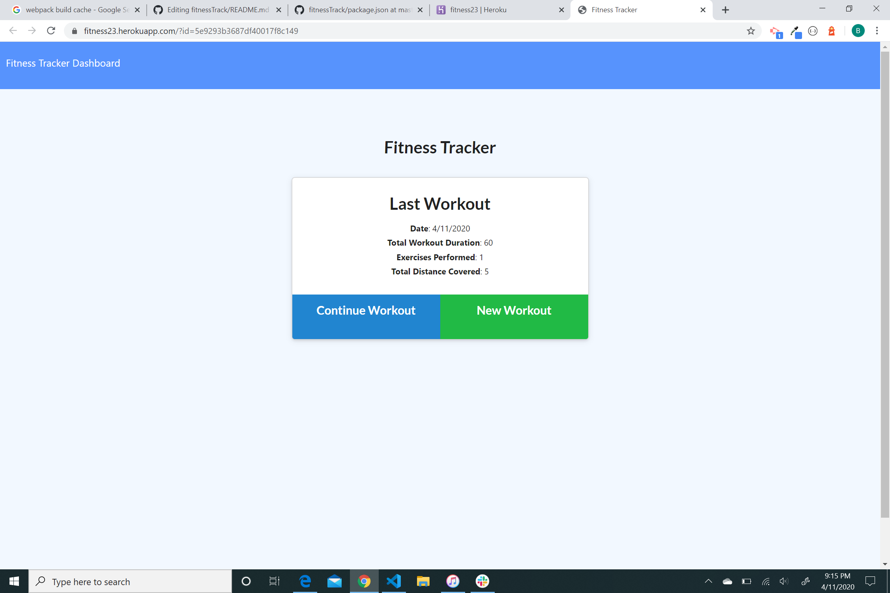
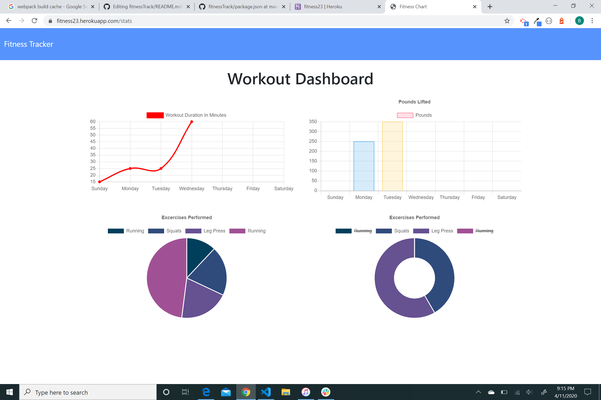

# fitnessTrack
Fitness workout app using mongoDB
## Description
A Fitness tracker app that tracks each workout. The landing page displays your last workout information if there is data present. You can continue to add exercises to that workout or you can start another one. Upon clicking the stats link, you will be shown graphs of your total workout information, 
## Contact
Please contact me at bmalkmus@uw.edu for any support issues.
## Acknowledgment
I would like to thank of all my teachers and TAs at University of Washington's Coding Bootcamp.   
Built with:  
* Mongoose DB  
* Heroku for deployment 
* mLab   
* morgan npm

## License
[MIT](https://choosealicense.com/licenses/mit/)

## Screenshots 
**Landing Page** 
 
   
 **Graphs** 
 
 

## Deployment
https://fitness23.herokuapp.com/
